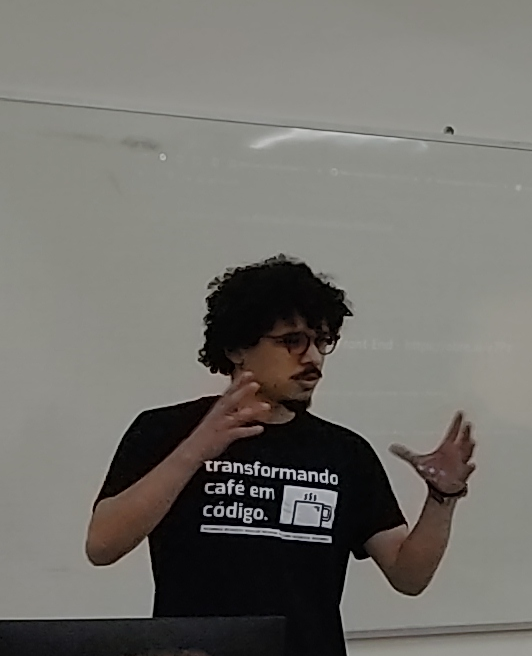

<h1 align="center">Hello, I'm Douglas Barcellos 👋</h1>

Front-End Engineer passionate about technology and programming.

**🌱 I’m currently:**

- Improving my knowledge in Angular
- In the Clean Code and Clean Architecture course by Rodrigo Branas.
- Reading Clean Architecture by Robert C. Martin
- Learning Flutter/Dart

<h2 align="center">⚡️Stack</h2>
  
🚀 Frameworks & Library

<code></code>

👩‍💻 Languages

<code></code>
  
📱 Mobile Frameworks

<code></code>
  
☁ Cloud

<code></code>

⚡ Database

<code></code>

🖍 Design

<code></code>

👩‍💻 IDE

<code></code>

💻 Terminal

<code></code>
